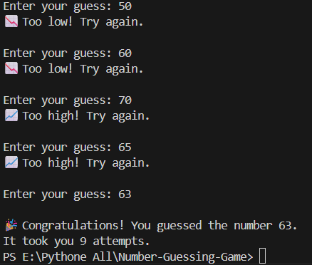

#  Number Guessing Game

A beginner-friendly command-line game built with Python where the computer randomly selects a number, and the player tries to guess it using hints.

This project was created to practice fundamental Python programming concepts such as loops, conditional statements, user input, and the `random` module.

---

##  Features

*  Random number generation
*  Hints after each guess (Too High / Too Low)
*  Unlimited attempts until the correct number is guessed
*  Counts the total number of attempts
*  Simple command-line interface
*  Great project for Python beginners

---

##  Technologies Used

* Python 3
* Python Random Module

---

## Project Structure

```text
Number-Guessing-Game/
│
├── main.py
├── README.md
└── screenshots/
    └── output.png
```

---

##  How to Run

### 1. Clone the repository

```bash
git clone https://github.com/Nextronix-083/Number-Guessing-Game.git
```

### 2. Navigate to the project directory

```bash
cd Number-Guessing-Game
```

### 3. Run the program

```bash
python main.py
```

---

##  Example Gameplay

```text
 Welcome to the Number Guessing Game!
I'm thinking of a number between 1 and 100.

Enter your guess: 25
 Too low! Try again.

Enter your guess: 70
 Too high! Try again.

Enter your guess: 48

🎉 Congratulations!
You guessed the number 48.
It took you 3 attempts.
```

---

## 📸 Output



---

##  Concepts Practiced

* Variables
* User Input
* Data Types
* Random Number Generation
* While Loops
* Conditional Statements (`if`, `elif`, `else`)
* Comparison Operators
* Loop Control (`break`)

---

##  Future Improvements

* Add difficulty levels (Easy, Medium, Hard)
* Limit the number of attempts
* Play Again option
* Score system
* High score tracker
* Input validation for invalid entries
* Graphical User Interface (GUI) using Tkinter or PyQt

---

##  Contributing

Contributions, suggestions, and improvements are welcome.

1. Fork the repository.
2. Create a new branch.
3. Commit your changes.
4. Open a Pull Request.

---

## 📄 License

This project is licensed under the MIT License.

---

## 👨‍💻 Author

**Nazmul Hosen**

* GitHub: https://github.com/Nextronix-083

If you found this project helpful, consider giving it a ⭐ on GitHub!
